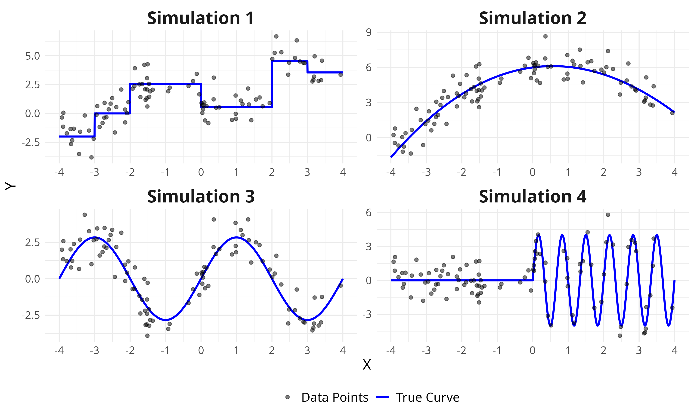
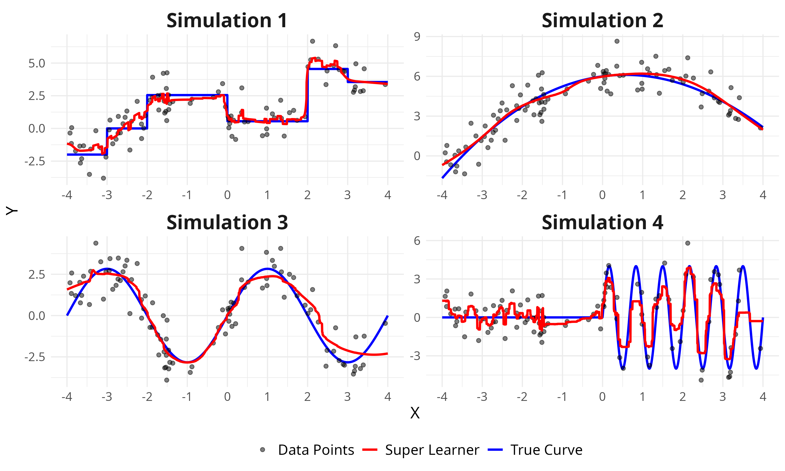
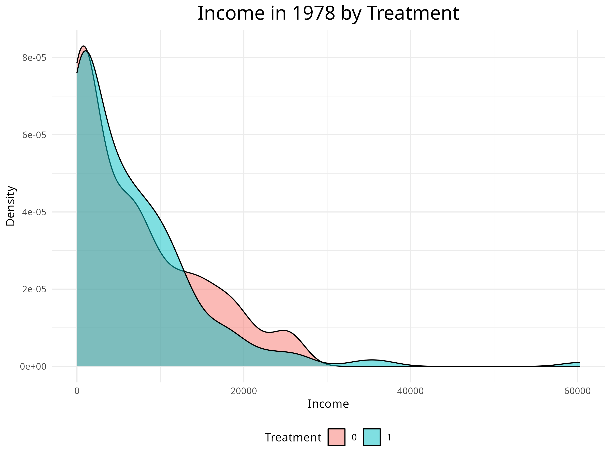

# Super learner

- [slides](https://jsr-p.github.io/slides/super-learner-tl/#/title-slide)

## Simulation example

**Simulated datasets:** 

**Simulated datasets with Super Learner fit on top:**



- [code](scripts/plot_sim.R)

### Simulation experiment

- [code](scripts/slearn.R)

## Lalonde



- [code](scripts/lalonde.R)

## reproduce

``` bash
bash main.sh
```

### sessionInfo

    R version 4.4.2 (2024-10-31)
    Platform: x86_64-pc-linux-gnu
    Running under: Arch Linux

    Matrix products: default
    BLAS:   /usr/lib/libblas.so.3.12.0 
    LAPACK: /usr/lib/liblapack.so.3.12.0

    locale:
     [1] LC_CTYPE=en_US.UTF-8       LC_NUMERIC=C              
     [3] LC_TIME=en_DK.UTF-8        LC_COLLATE=en_US.UTF-8    
     [5] LC_MONETARY=en_US.UTF-8    LC_MESSAGES=en_US.UTF-8   
     [7] LC_PAPER=en_US.UTF-8       LC_NAME=C                 
     [9] LC_ADDRESS=C               LC_TELEPHONE=C            
    [11] LC_MEASUREMENT=en_US.UTF-8 LC_IDENTIFICATION=C       

    time zone: Europe/Copenhagen
    tzcode source: system (glibc)

    attached base packages:
    [1] splines   stats     graphics  grDevices utils     datasets  methods  
    [8] base     

    other attached packages:
     [1] xgboost_1.7.8.1      tmle_2.0.1.1         polspline_1.1.25    
     [4] SuperLearner_2.0-29  nnls_1.5             randomForest_4.7-1.2
     [7] nnet_7.3-19          ipred_0.9-15         glmnet_4.1-8        
    [10] Matrix_1.7-1         ggplot2_3.5.1        gbm_2.2.2           
    [13] gam_1.22-4           foreach_1.5.2        dplyr_1.1.4         
    [16] data.table_1.16.99   BART_2.9.9           survival_3.7-0      
    [19] nlme_3.1-166        

    loaded via a namespace (and not attached):
     [1] future_1.34.0       utf8_1.2.4          generics_0.1.3     
     [4] class_7.3-22        shape_1.4.6.1       lattice_0.22-6     
     [7] listenv_0.9.1       digest_0.6.35       magrittr_2.0.3     
    [10] evaluate_0.23       grid_4.4.2          iterators_1.0.14   
    [13] fastmap_1.1.1       jsonlite_1.8.8      fansi_1.0.6        
    [16] scales_1.3.0        codetools_0.2-20    lava_1.8.1         
    [19] cli_3.6.3           rlang_1.1.4         parallelly_1.42.0  
    [22] future.apply_1.11.3 munsell_0.5.1       withr_3.0.1        
    [25] yaml_2.3.8          prodlim_2024.06.25  tools_4.4.2        
    [28] parallel_4.4.2      colorspace_2.1-0    globals_0.16.3     
    [31] vctrs_0.6.5         R6_2.5.1            rpart_4.1.23       
    [34] lifecycle_1.0.4     MASS_7.3-61         pkgconfig_2.0.3    
    [37] pillar_1.9.0        gtable_0.3.5        glue_1.8.0         
    [40] Rcpp_1.0.13         xfun_0.50           tibble_3.2.1       
    [43] tidyselect_1.2.1    knitr_1.46          htmltools_0.5.8.1  
    [46] rmarkdown_2.28      compiler_4.4.2     

### Python

``` bash
uv venv
source venv/bin/activate
uv pip install -r requirements.txt
```
